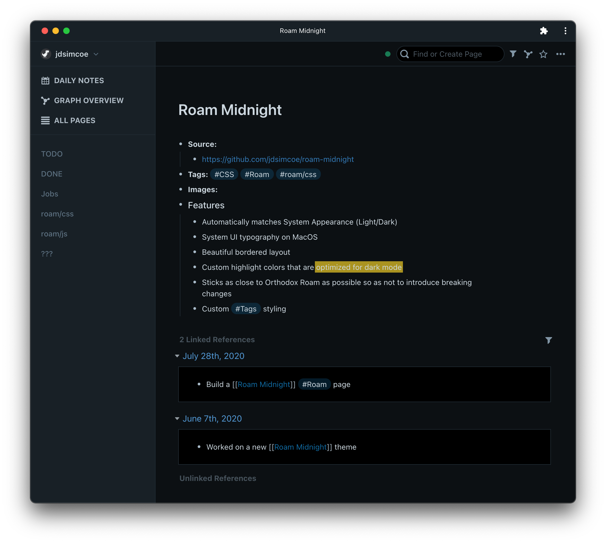
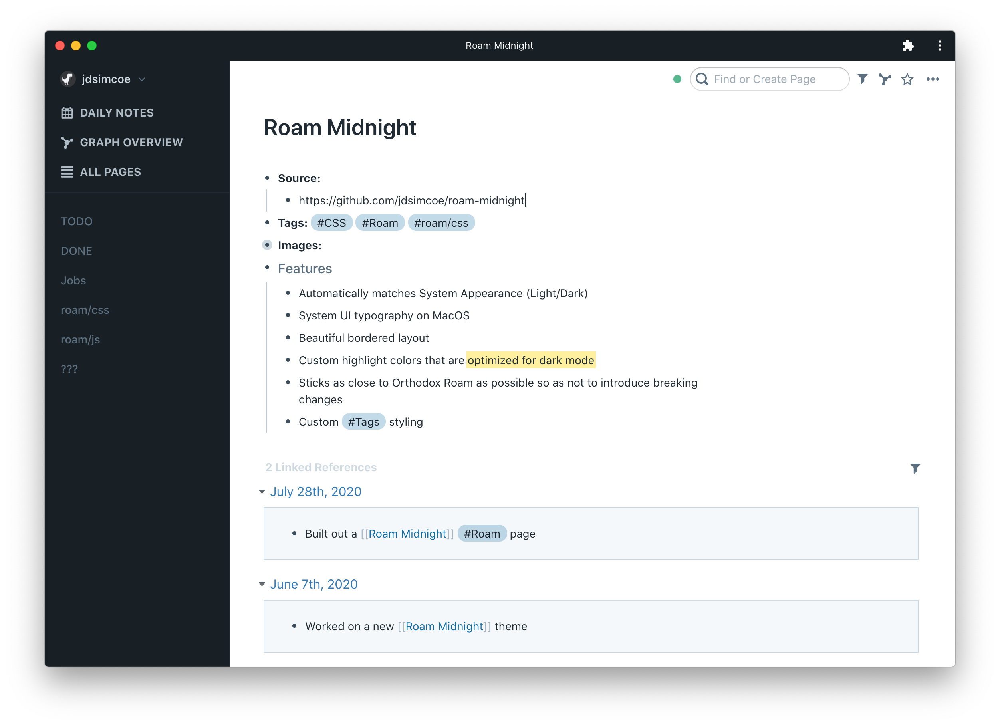

## Roam Midnight

A dark & light minimal CSS theme for Roam Research.

### Screenshots

Dark Mode

Light Mode

### Features

- Automatically matches System Appearance (Light/Dark)
- System UI typography on MacOS
- Beautiful bordered layout
- Custom highlight colors that are optimized for dark mode
- Sticks as close to Orthodox Roam as possible so as not to introduce breaking changes
- Custom Tags styling

### Installation

Either copy and paste styles from [styles.css](https://github.com/jdsimcoe/roam-midnight/blob/master/styles.css) or simply use an `@import 'https://raw.githubusercontent.com/jdsimcoe/roam-midnight/master/styles.css'` statement in a CSS code block on your graph's [[roam/css]] page.